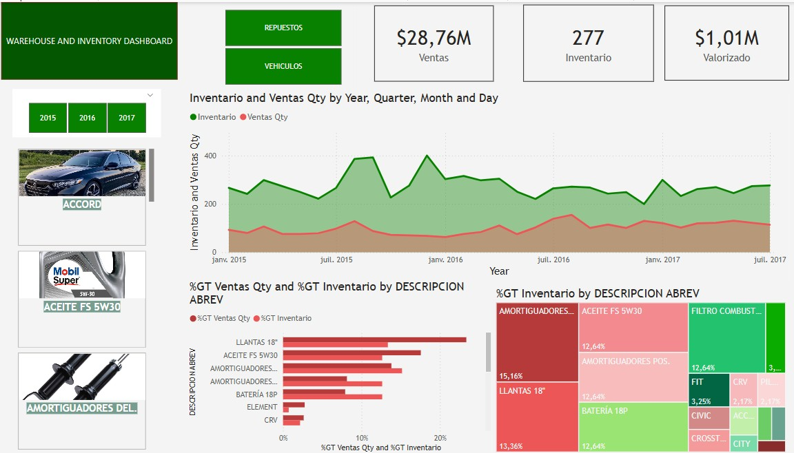

# 📦 Logistic & Inventory Dashboard – Power BI

This project presents an interactive Power BI dashboard designed to monitor inventory levels, stock valuation, and sales by warehouse and product type.

## 📊 Dashboard Features

- ✅ Total Inventory (units)
- ✅ Inventory Valuation (monetary)
- ✅ Total Sales by product type
- ✅ Year and Product Type slicers (e.g., Vehicles, Spare Parts)
- ✅ KPI cards and interactive filtering
- ✅ Star schema with fact and dimension tables

## 🧰 Tools & Technologies

- Power BI Desktop
- DAX (for calculated measures and KPIs)
- Excel (source dataset)
- GitHub (project repository)

## 📁 Project Files

| File | Description |
|------|-------------|
| `logistic-application-powerBI.pbix` | Main Power BI file |
| `Dashboard Almacenes.xlsx` | Sample dataset (anonymized) |
| `dashboard_view.jpg` | Dashboard screenshot |

## 🖼️ Preview

